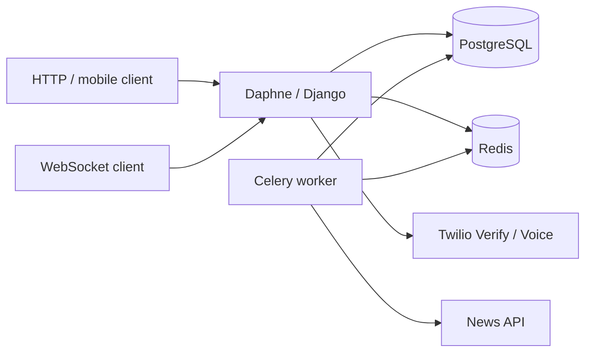

# Retroville API

[](https://github.com/VaughnDV/retroville-api/actions/workflows/ci.yml)
[](https://www.python.org/downloads/)
[](https://docs.djangoproject.com/en/5.2/releases/5.2/)
[](https://github.com/astral-sh/ruff)
[](https://python-poetry.org/)
[](LICENSE)

Django API for **spontaneous activity matching** and **real-time chat**: people who liked the same daily stories can be paired, then talk over WebSockets or a Twilio voice token.

Originally built in 2019. Recovered in 2026 onto a supported stack, with characterisation tests, fail-closed settings, and GitHub Actions — without rewriting the 2019 commits as if they were always modern.

This repository is a **completed engineering showcase**. It is not under active maintenance.

## Why this is here

This is not a greenfield demo. It is a production-style 2019 backend (DRF, PostgreSQL, Celery, Redis, Channels, Twilio) brought forward in public Git history.

| 2019 | 2026 |
| --- | --- |
| Python 3.6, Django 2.1 | Python 3.12 (3.13 in CI), Django 5.2 LTS |
| Unpinned / abandoned packages, Travis, Heroku | Poetry lockfile, GitHub Actions, Compose |
| Matching mixed into views and Celery | Domain rules, transactional services, idempotent tasks |
| Live Twilio / News API in tests | Provider fakes; offline demo needs no paid keys |
| Hard-coded secrets, tracked Redis dump | Env-based settings, rewritten history, rotated credentials |

The useful story is the migration, not a pretend rewrite of 2019.

## Architecture



- **HTTP** — Django REST Framework, token auth, object-level permissions.
- **Matching** — Jaccard rules in `retroville/matching/domain.py`, transactions in `services.py`, Celery in `tasks.py`.
- **Providers** — Twilio and News sit behind small interfaces; tests and the demo use fakes.
- **Realtime** — Channels with token auth, origin checks, and a message size cap.
- **Health** — `/health/live/` is process-only; `/health/ready/` checks PostgreSQL and Redis.

More detail: [architecture](docs/architecture.md) · [ADRs](docs/decisions/) · [2019 baseline](docs/legacy-baseline.md) · [upgrade path](docs/migration-path.md)

## Quick start

No Twilio or News API keys are required.

```bash
cp .env.example .env
make compose-up
```

| | |
| --- | --- |
| OpenAPI UI | http://127.0.0.1:8000/api/docs/ |
| Schema | http://127.0.0.1:8000/api/schema/ |
| Liveness | http://127.0.0.1:8000/health/live/ |
| Readiness | http://127.0.0.1:8000/health/ready/ |
| Demo login | `owner@example.com` / `password123` |

```bash
TOKEN=$(curl -s -X POST http://127.0.0.1:8000/api-token-auth/ \
  -H 'Content-Type: application/json' \
  -d '{"username":"owner@example.com","password":"password123"}' | jq -r .token)

curl -H "Authorization: Token $TOKEN" http://127.0.0.1:8000/api/v1/whoami/
curl -H "Authorization: Token $TOKEN" http://127.0.0.1:8000/api/v1/match/find/
```

Re-seed the synthetic demo with `make seed`.

## Development

```bash
make install            # Poetry + pre-commit
make lint               # Ruff
make typecheck          # mypy on the extracted modules
make test               # unit + characterisation (no network)
make test-integration   # PostgreSQL, Redis, Channels
make audit              # pip-audit
make docs               # MkDocs
```

Unit tests must not touch the network. Integration tests are marked and run in CI against PostgreSQL 16 and Redis 7. Coverage fails the build below 55%.

## Status and limitations

- Matching still samples the shared story from the Jaccard intersection, as in 2019.
- Chat does not replay missed messages after reconnect.
- Live Twilio is optional; the demo mints fake voice tokens.
- Personal email addresses from 2019 remain in Git history (not credentials).
- This is a finished showcase, not a product you should deploy as-is.

See [known failures](docs/known-failures.md) and [SECURITY.md](SECURITY.md).

## Licence

[MIT](LICENSE) © 2019 Vaughn de Villiers
