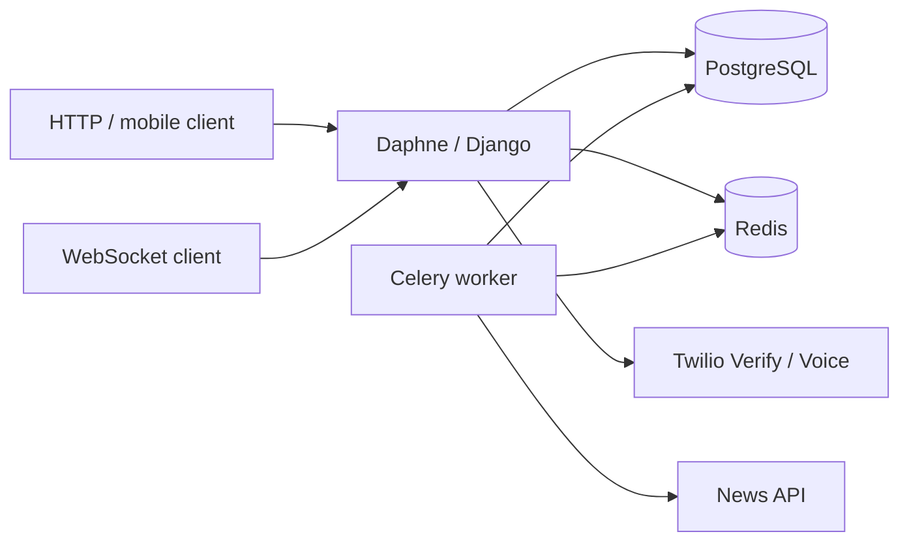

# Architecture

Retroville matches people who liked the same daily stories, then hands them
Twilio voice tokens and an optional chat room.

- **HTTP API** — Django REST Framework, token auth, object-level permissions.
- **Matching** — pure Jaccard rules in `matching/domain.py`, transactional
  use-cases in `matching/services.py`, Celery wrappers in `matching/tasks.py`.
- **Providers** — Twilio and News sit behind protocols with fakes for tests
  and the offline demo.
- **Realtime** — Channels with token auth, origin checks and a message size cap.
- **Health** — `/health/live/` is process-only; `/health/ready/` checks
  PostgreSQL and cache.

See `docs/decisions/` for why Django 5.2, fakes-by-default and fail-closed
production settings were chosen.
